# ServoSight-Rebrand

I worked with ServoSight team on rebranding MVP version of the platform they built.
I wasn't a full time member of the work team, just part time worker joined the team to work on rebrand the app and implement the main dashboard
I can't share project's repo with codes but it was one of the interesting projects I worked on. 
ServoSight is assets managment platfrom with unique features that aims to help manufacturers with complicated industry products. 
I will share some screenshots from the output of my work on this project.

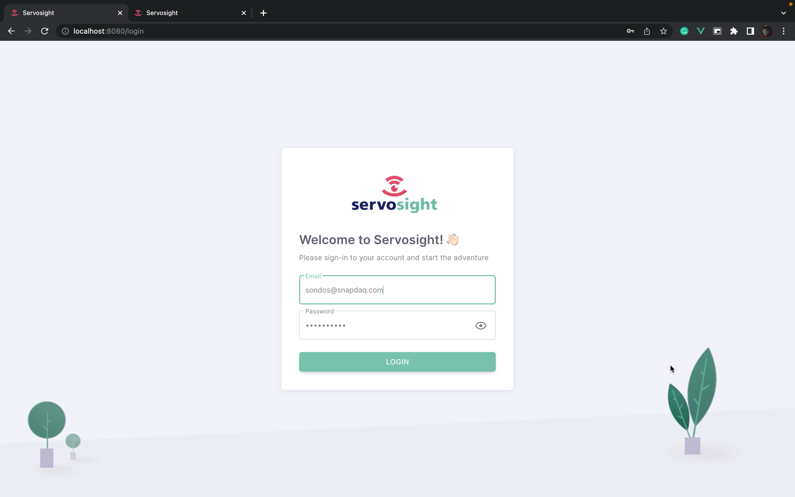
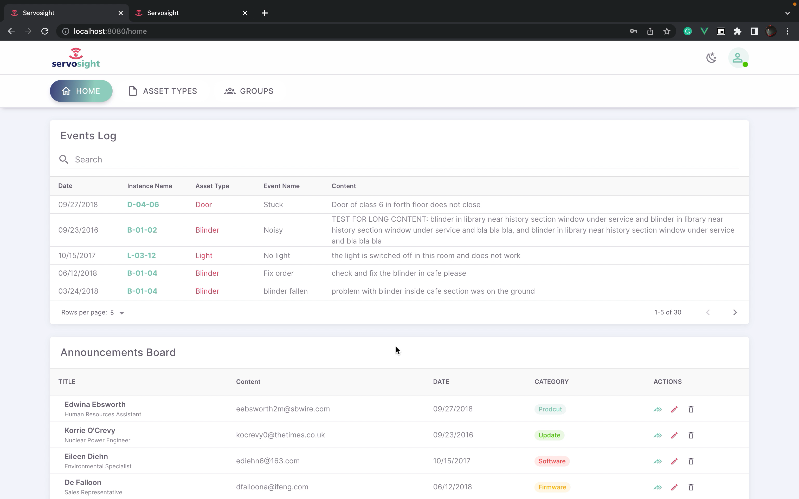
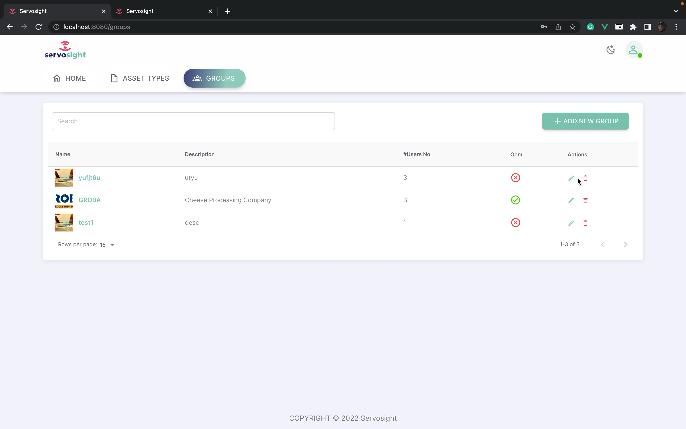
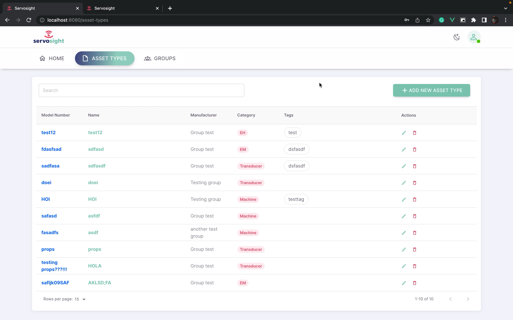
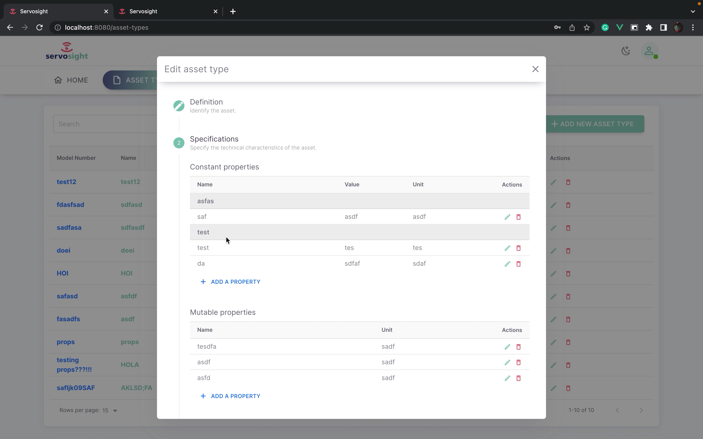
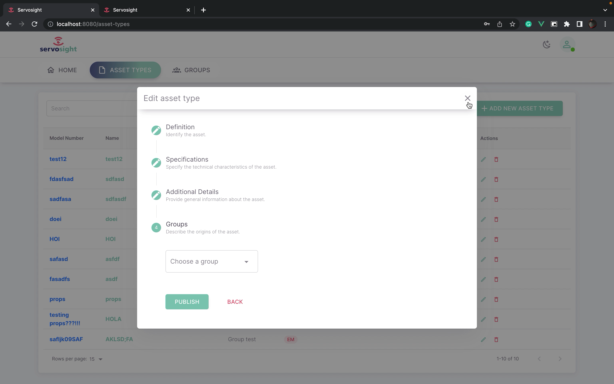
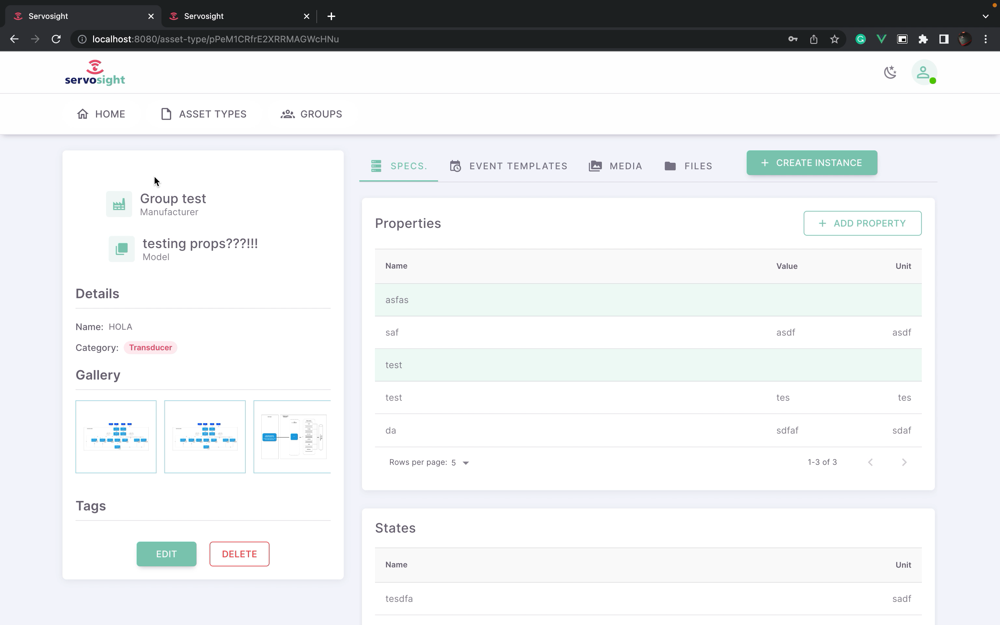
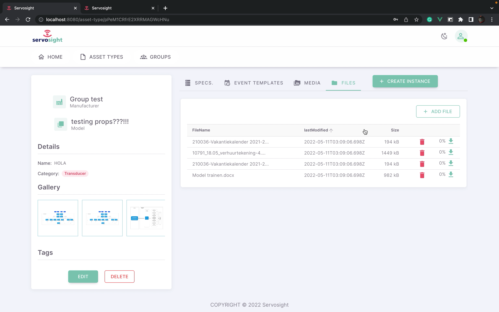
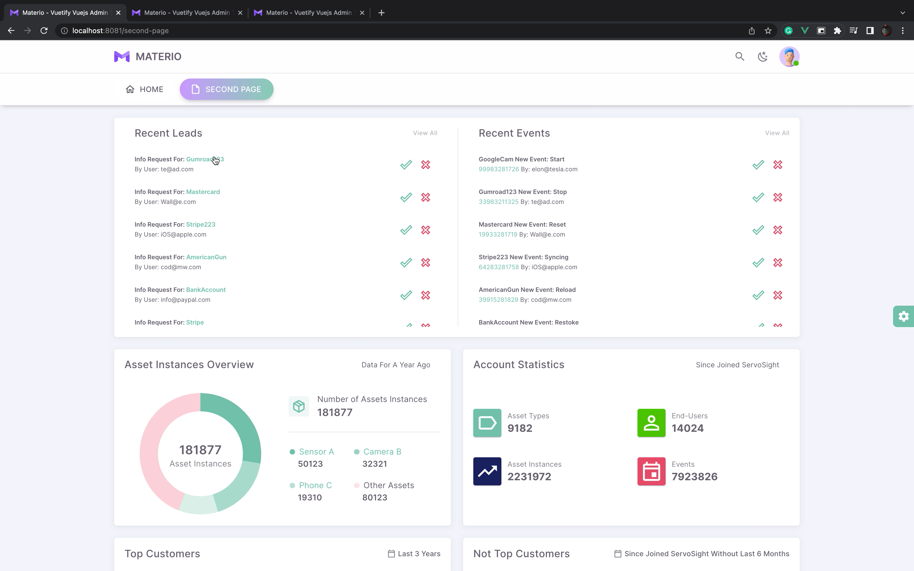
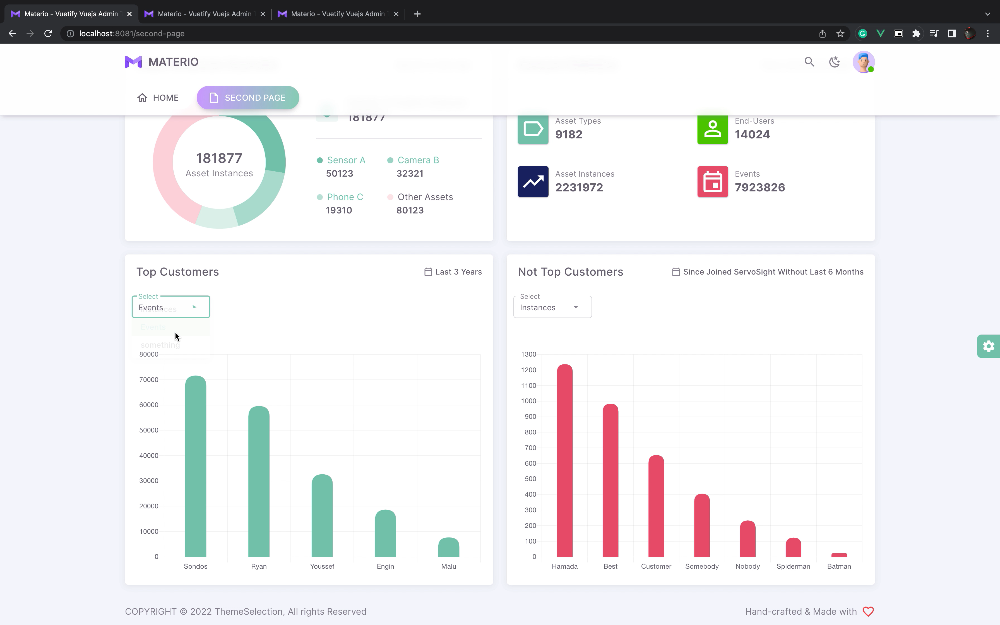
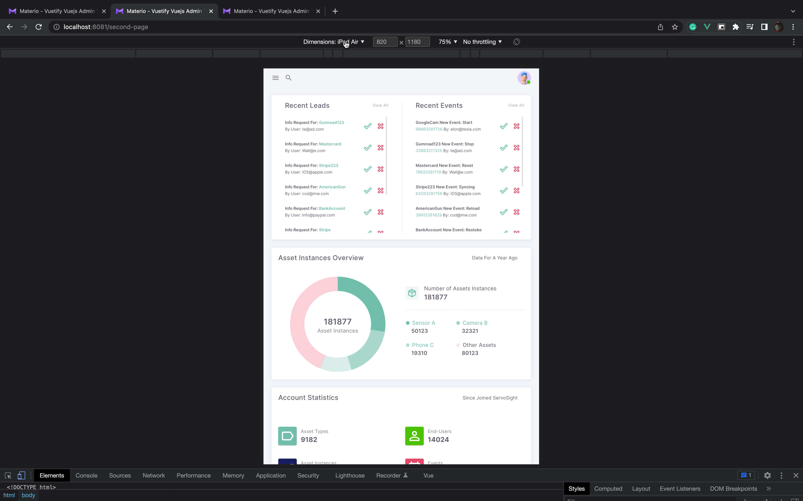
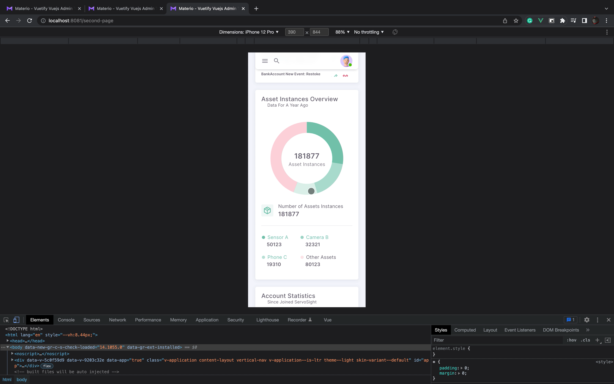
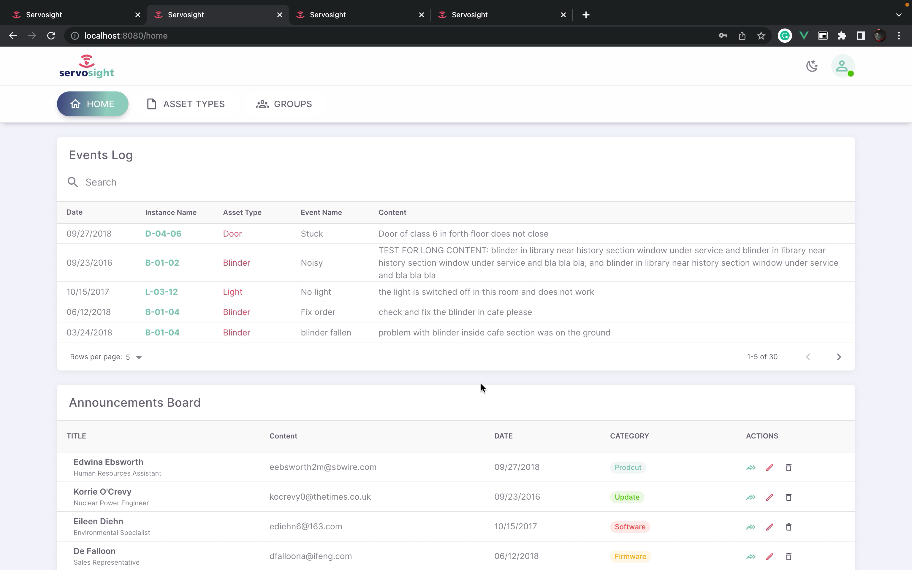
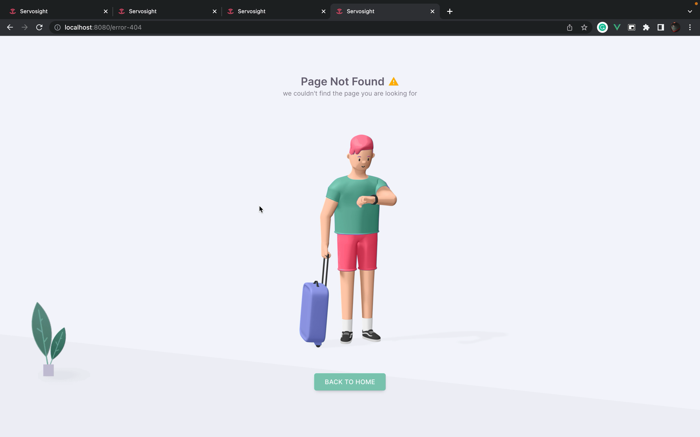
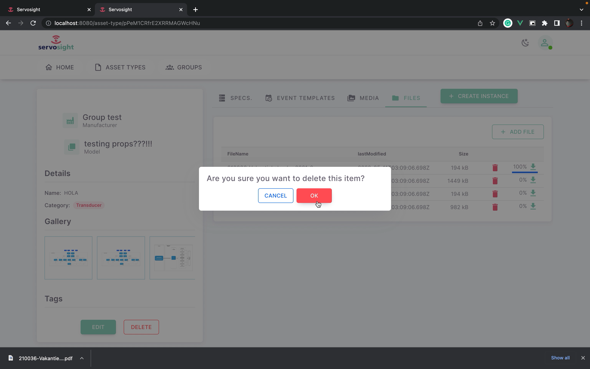
